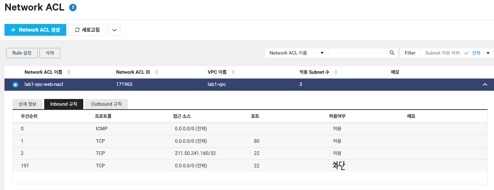

# 🧱 Lab 1. 네트워크 환경 구성 (VPC 및 Subnet 생성)

## 🧭 목표
클라우드 내부에 독립된 네트워크 환경(VPC)을 만들고, 서브넷 및 Network ACL을 구성한다.

---

## 1️⃣ VPC 생성
| 항목 | 값 |
|------|----|
| 이름 | lab1-vpc |
| IP 대역 | 10.0.0.0/16 |
| 설명 | 웹 서버용 기본 네트워크 |

**설명:**  
VPC는 가상 사설 네트워크로, 서비스 간 트래픽을 분리하고 보안적으로 독립된 환경을 제공함.

---

## 2️⃣ Subnet 생성
| 항목 | 값 |
|------|----|
| 이름 | lab1-web-subnet |
| IP 대역 | 10.0.1.0/24 |
| 존 | KR-2 |
| 역할 | 웹 서버 배치용 |

**설명:**  
VPC 내부에서 네트워크를 세분화하여 서버 그룹을 분리.  
웹, DB, Load Balancer 영역을 각각 다른 Subnet으로 분리 가능.

---

## 3️⃣ 🔒 Network ACL 설정
**Network ACL**은 Subnet 단위의 트래픽 제어 정책으로, 인바운드/아웃바운드 규칙을 지정할 수 있다.

INBOUND

| 우선순위 | 프로토콜 | 접근 소스 | 포트 | 허용 여부 |
|---|-----|-----------|----|-------|
| 0 | ICMP| 0.0.0.0/0 | -- | 허용 |
| 1 | TCP | 0.0.0.0/0 | 80 | 허용 |
| 2 | TCP | 211.50.241.160/32 | 22 | 허용 |
| 197| TCP | 0.0.0.0/0 | 22 | 허용 |

**설명:**  
- SSH(22) → 원격 접속용  
- HTTP(80) → 웹 서버 접근용  
- ICMP → ping 테스트 허용  

**NACL 화면 예시:**  

OUTBOUND

| 우선순위 | 프로토콜 | 목적지 | 포트 | 허용 여부 |
|---|-----|-----------|----|-------|
| 0 | ICMP| 0.0.0.0/0 | -- | 허용 |
| 1 | TCP | 0.0.0.0/0 | 1-65535 | 허용 |
| 2 | UDP | 0.0.0.0/0 | 1-65535 | 허용 |

**설명:**  
- ICMP → ping 테스트 허용
- TCP → 밖으로 나가는 모든 TCP 허용
- UDP → 밖으로 나가는 모든 UDP 허용
  
**NACL 화면 예시:**  

---

## 4️⃣ 📊 설정 결과
- VPC, Subnet, NACL 정상 생성 확인  
- Subnet에 웹 서버 인스턴스 연결 예정  

---

## 💬 요약
- VPC → 내부 네트워크 경계 생성  
- Subnet → 서비스별 분리 구조  
- Network ACL → Subnet 레벨 보안 정책 적용  

> 💡 **Tip:**  
> ACG는 인스턴스 단위 방화벽,  
> NACL은 Subnet 단위 트래픽 제어.  
> 둘 다 설정해야 완전한 보안 레이어 형성 가능.
