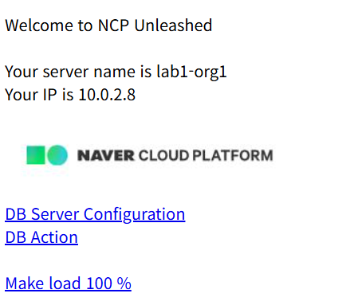

# 🌐 Lab 2. 웹 서버 생성

## 목표
VPC 내에 웹 서버를 구축하고 Apache + PHP 환경을 구성한다.

## 단계
1. **ACG 생성** – 22, 80, ICMP 허용
2. **Init Script 등록** – Apache, PHP, MariaDB 자동 설치
3. **서버 생성** – Rocky Linux 8.10, 2vCPU, 8GB
4. **공인 IP 연결 및 웹 페이지 테스트**

## 테스트 결과

