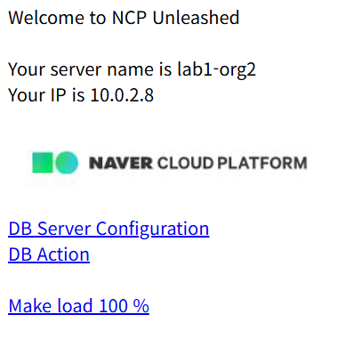

# 🌍 Lab 3. DNS 및 로드밸런서 구성

## 목표
웹 서버 다중화를 위해 로드밸런서를 구성하고 도메인에 연결한다.

## 단계
1. Load Balancer용 Subnet 생성  
2. Target Group 구성  
3. Application Load Balancer 생성  
4. Global DNS 등록  
5. CNAME 레코드로 www 도메인 연결

## 결과
 |  |

