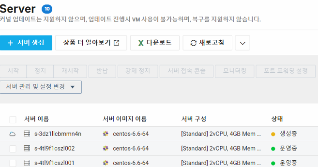

# ⚙️ Lab 4. Auto Scaling 구성

## 목표
트래픽 변화에 자동 대응하기 위한 Auto Scaling Group 구성

## 단계
1. Launch Configuration 생성 (기존 서버 이미지 기반)
2. Auto Scaling Group 생성 (최소 1, 최대 3)
3. Cloud Insight 연동 – CPU 10% 이상 시 서버 증설 트리거

## 결과

서버 2대 → 부하 증가 시 3대로 자동 확장 확인  

