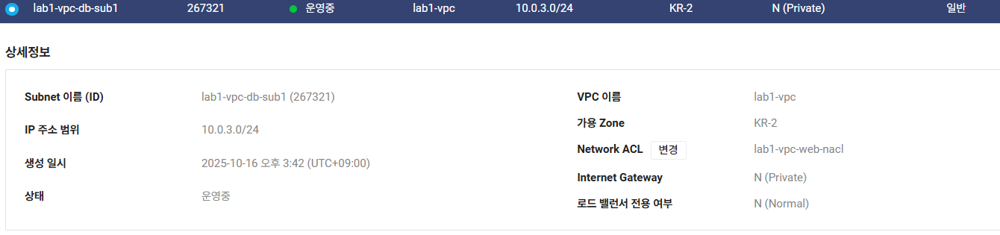
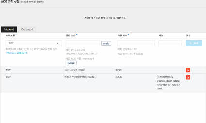
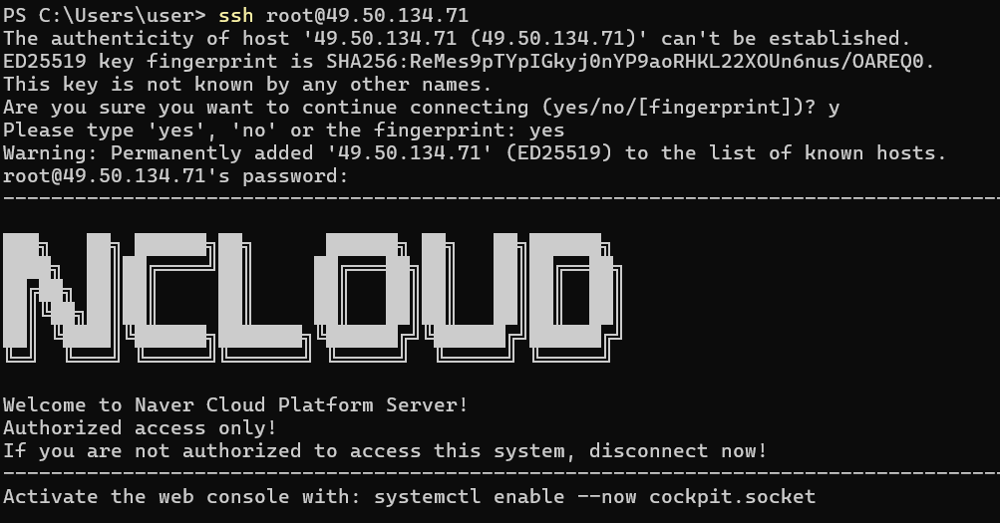

# 🗄️ Lab 5. Cloud DB 생성 및 웹 서버 연동

## 🧭 목표
Private Subnet에 Cloud DB for MySQL을 생성하고,  
Public Subnet의 웹 서버와 내부 통신으로 연동한다.

---

## 1️⃣ 구성 개요
이번 실습에서는 기존에 생성한 VPC 내부에서  
- **Public Subnet (10.0.1.0/24)** → Web Server  
- **Private Subnet (10.0.3.0/24)** → Cloud DB  

구조로 내부 통신만 허용하는 아키텍처를 구축한다.

**사전 생성한 서브넷**

---

## 2️⃣ Cloud DB 인스턴스 생성

| 항목 | 설정값 |
|------|--------|
| 서비스 | Cloud DB for MySQL |
| DB 서버 이름 | edu |
| DB 버전 | MySQL 8.0 |
| VPC | lab1-vpc |
| Subnet | lab1-vpc-db-sub1 (Private) |
| 접근 설정 | Public Access 비활성화 |
| 포트 | 3306 |
| 스토리지 | 10GB |
| 백업 | 일일 자동 백업 비활성화 | # 실사용 목적이 아니므로

**설명:**  
DB는 외부 접근이 불필요하므로 Private Subnet에 배치하고,  
웹 서버에서만 접근할 수 있도록 ACG를 별도 구성한다.

---

## 3️⃣ 🔒 ACG 설정 (웹 → DB 허용)

**요약:**  
- DB ACG에서는 웹 서버 서브넷 IP만 허용  
- 외부(인터넷)에서의 접근은 완전 차단  

---

## 4️⃣ DB 접속 및 초기 설정
Cloud DB 콘솔에서 연결 정보 확인 후,  
웹 서버에서 내부 IP로 접속 테스트 진행.

# DB 생성 및 사용자 추가
CREATE DATABASE webdb;
CREATE USER 'webuser'@'%' IDENTIFIED BY '1234';
GRANT ALL PRIVILEGES ON webdb.* TO 'webuser'@'%';
FLUSH PRIVILEGES;
